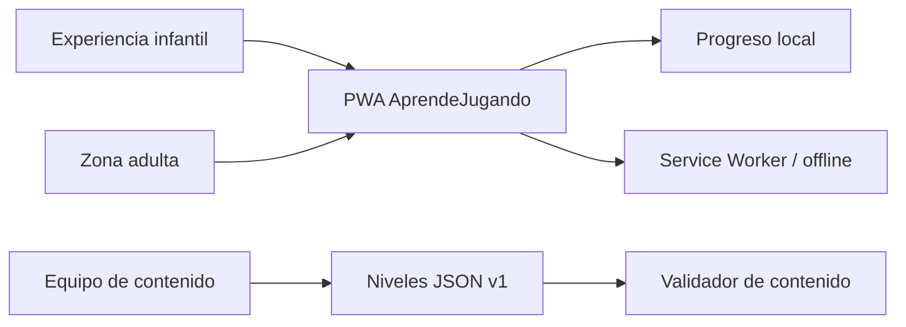
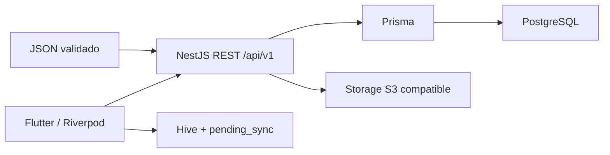

# Contexto del sistema

## Estado implementado

El vertical slice permite validar producto y UX sin infraestructura externa. `localStorage` es apropiado solo para este prototipo; no representa el modelo de seguridad final.

## Arquitectura objetivo

El backend será autoridad de respuestas, recompensas, permisos, publicación e idempotencia. Flutter renderizará contratos publicados y guardará intentos offline con `clientAttemptId`.

## Decisiones

- Contrato `schemaVersion: 1` para congelar la forma inicial antes de crear contenido masivo.
- Contenido separado del progreso individual.
- IDs por área para reducir conflictos entre integrantes.
- Feedback neutral ante errores; sin rachas punitivas ni rankings.
- Objetivos táctiles mínimos de 56 px y una acción principal por reto.
